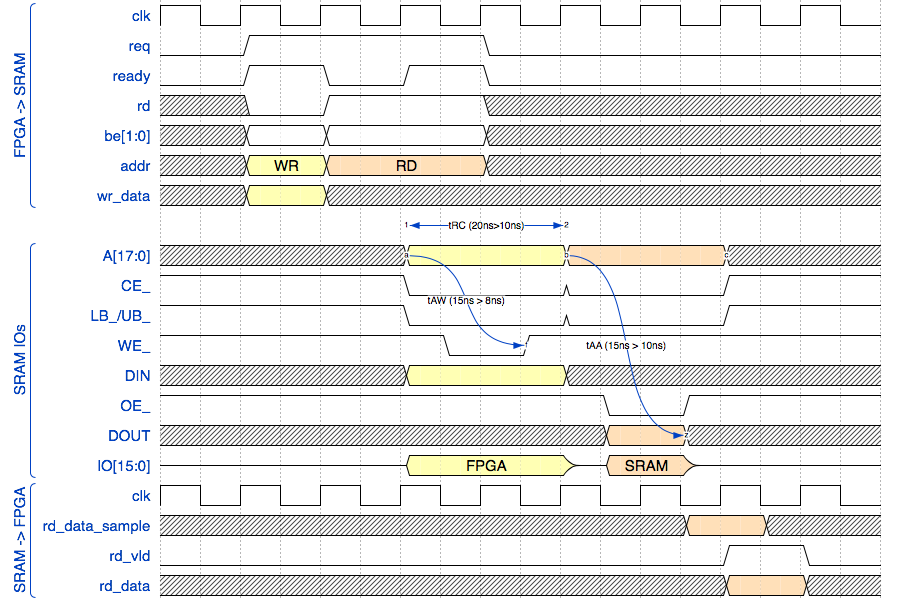

# Fast SRAM Example

This example illustrates how to implement a fast SRAM controller that can access the SRAM at one
transaction every 2 clock cycles while still running at 100MHz.



The SRAM on the BlackIce-II has a worst case access time of 10ns for both reads and write. The board also has a 100MHz
oscillator.

If we don't want to use a PLL to access the SRAM, we can control the IOs of the SRAM with increments of 5ns
by using both the rising and falling edges of the clock.

All input signals of the SRAM except OE_ need to be stable for at least 10ns to ensure the integrity of a 
transaction. Since we have no knowledge of the board skew and delay of the signals that run between the FPGA and the
SRAM, this means that we need present signals to the SRAM for 15ns. We also need 5ns of idle time to switch
the data bus from write to read and back, so we need 2 full clock cycles per SRAM transaction.

As can be seen on the waveform diagram, all input signals except WE_ and OE_ are launched off the positive edge flip-flops.

The IceStorm open source tools do not provide ways to maintain tight control over input and output delays, so to keep the
skew between signals in check, the design uses the flip-flops that are inside the SB\_IO IO pads.

This is especially important for the data IO pins: it's essential that the data bus is in tri-state for some time when
switching between reads and writes. A conflict where both devices are driving the bus could result in a power drop that's 
large enough to reset the FPGA and remove all its contents. 

In the current design, we have a simulated ideal tri-state time of 5ns, but various delays from the 
FPGA to the SRAM and back will make this much smaller: when switching from a read to a write operation, it can 
take up to 4ns (tHZB in the SRAM datasheet) between the rising edge of OE_ and the SRAM data bus to go to tri-state!

It would have been possible to generate the negative edge WE_ and OE_ signals by feeding the SB\_IO OUTPUT\_CLK port with
an inverted clock, however the ICE40 FPGA requires that IOs that are part of the same PIO group (each containing 2 IOs)  
use the same signals for control ports such as CLOCK\_ENABLE, INPUT\_CLK, OUTPUT\_CLK etc. On the BlackIce-II board, the OE_ pin 
and UB pin are assigned to the same PIO group. As a result using an inverted clock for OE_ is not possible! The same is true 
for the WE_ pin, which sits in the same PIO group as ADR[16].

Since an inverted clock could not be used for WE_ and OE_, the alternative is to use the DDR mode of the SB_IOs. This is 
slightly more complicated, but it actually provides much better control of the skew of the output signals: it ensures
that only 1 clock signal is routed to all the IOs, and the signals are created with real posedge or negedge FFs, whereas 
inverting the clock and routing it to the WE_ and OE_ IOs would have required an inverter and routing in the FPGA core.

A new read or write transaction can be issued at will every 2 clock cycles. Read data returns 4 cycles after a read
transaction has been accepted.

The example design has a block called ```ram_test``` that checks that the SRAM functions correctly. It does this as follows:
* It first goes through a write-only initialization procedure that writes a value to each location of the RAM. (The content
  of each memory location is the address of the memory location.)
* It then loops indefinitely by alternating between reads sand writes all the time. The write operations use an incrementing
  address, where the same value as before is written. The read operations use a decrementing address and check the value of 
  data that comes back.
* When at least one read operation results in a match, LED4 (the blue LED) will go on.
  A failing read operations makes LED3 (green, next to the blue LED) light up.
* Once lit, LED 3 and 4 will stay lit until you press button B1, which resets both LEDs.
* When you press button B2, the design will corrupt the data that is being returned from the SRAM, and LED3 will light up. 
  Use this button to check that the RAM tester is doing its job!

If all goes well, only the blue LED should light up and the green LED will only light up after pressing B2.

In addition to LEDs 3 and 4, LED1 (red) will be blinking at a rate of roughly once every 1.5 seconds.

